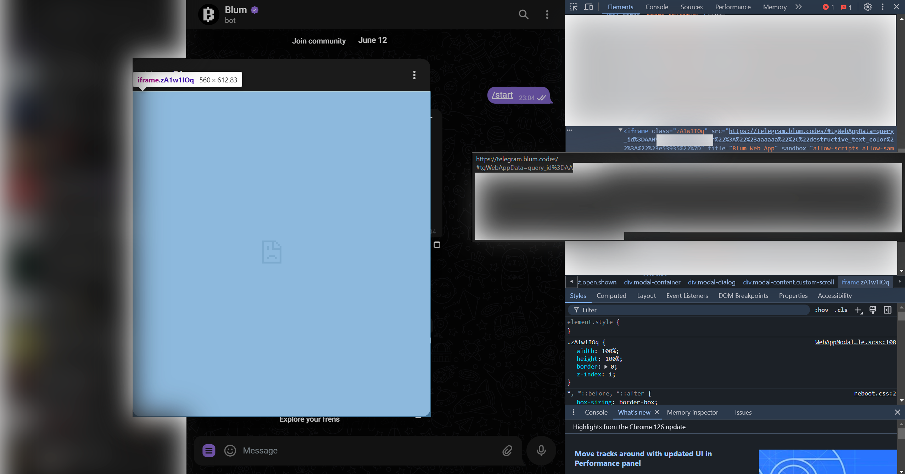
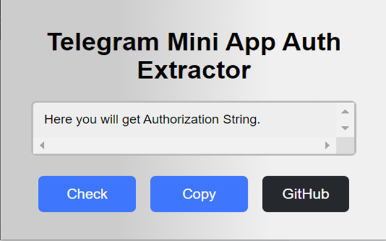
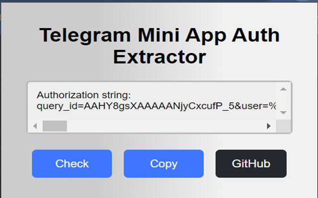

# Telegram Mini App Auth Extractor
**This is a Chrome Extension that helps to get authorization from any Mini App using Telegram Web version, even if the app does not work in Web version.**

Link to it in Chrome Extensions Store: [here it is](https://chromewebstore.google.com/detail/telegram-mini-app-auth-ex/fjmkmlebpiodjmkpbpblflpgkmojigpm).

It was created for my another huge project users: [Auto Blum Farm Bot in Telegram](https://t.me/AutoBlumFarm).
You can find it's source at [backend repo](https://github.com/ButterDevelop/BlumBotFarm) and [frontend repo](https://github.com/ButterDevelop/AutoBlumFarmBot).

## How does it work?

Telegram, in the case of Mini Apps, always sends authorization specifically for this application when it is opened. In this case, in the Web version, the Mini App opens using an `<iframe>`, inside of which a link is written in the `src` attribute. This link contains authorization - user's data and it's hash.

The server checks the hash. In short, hashing occurs with a certain `key`, which is the `API token` of the telegram bot, respectively, the telegram knows it, and the developer knows it, but you don't know it, you only have the initial data and its hashed result. And, if successful, gives you its own authorization. Therefore, bot programs for Mini Apps (or why else would you need this extension for the most part) require this authorization. It's easier to get and better.

### Screenshots

